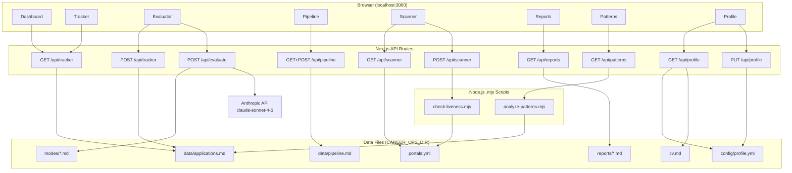
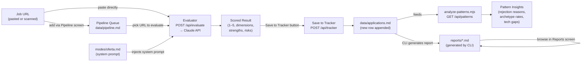
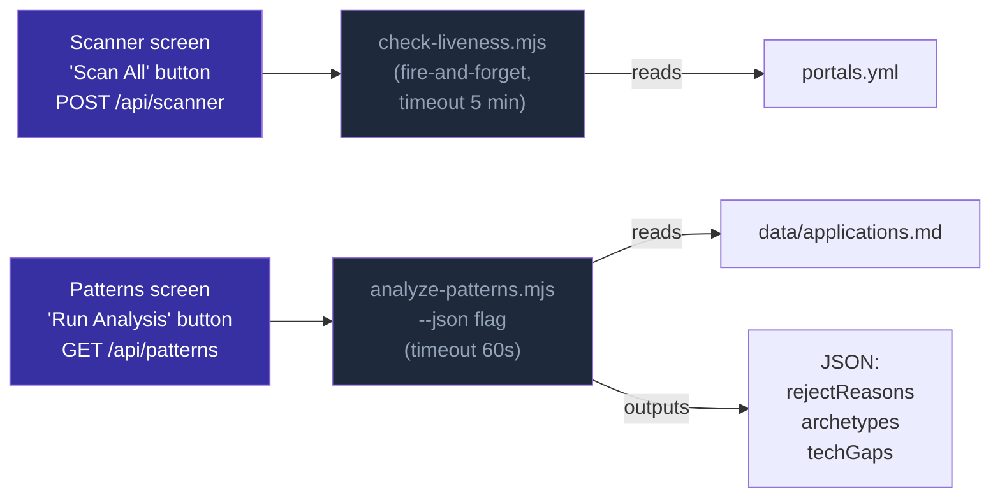

# career-ops UI

A Next.js dashboard for the [career-ops](https://github.com/santifer/career-ops) job-search pipeline. Browse your application tracker, evaluate job descriptions with Claude, manage a URL queue, scan target companies, view AI-generated reports, and analyse rejection patterns — all from a single dark-mode interface.

---

## 1. Overview

**What it is:** A local-only web UI that reads and writes the same flat files that the career-ops CLI uses (`data/applications.md`, `data/pipeline.md`, `portals.yml`, `config/profile.yml`, `reports/*.md`). It does not replace the CLI — it gives you a visual command centre on top of it.

**What problem it solves:** The CLI evaluations and tracker updates happen in the terminal, scattered across markdown files. The UI surfaces everything in one place: charts, sortable tables, an inline evaluator, and a report reader.

**Tech stack:**

| Layer | Technology |
|---|---|
| Framework | Next.js 14 App Router (TypeScript) |
| Styling | Tailwind CSS |
| Charts | Recharts (BarChart, PieChart) |
| Icons | Lucide React |
| AI | `@anthropic-ai/sdk` → `claude-sonnet-4-5` |
| Runtime | Node.js (spawns `.mjs` scripts via `child_process`) |

---

## 2. Quick Start

```bash
cd myagents/projects/job-search/career-ops-ui

# 1. Copy and fill in the environment file
cp .env.local.example .env.local
# Edit .env.local — set CAREER_OPS_DIR and ANTHROPIC_API_KEY

# 2. Install dependencies
npm install

# 3. Start the dev server
npm run dev
# → http://localhost:3000
```

> **`CAREER_OPS_DIR` must be the absolute path to the `job-search` directory.**
> Example: `/Users/yourname/myrepo/myagents/projects/job-search`
>
> If this variable is not set, the server falls back to `../../` relative to the Next.js project root, which resolves to the same directory when you start the server from inside `career-ops-ui/`.

---

## 3. Environment Variables

| Variable | Required | Description | Example |
|---|---|---|---|
| `CAREER_OPS_DIR` | Recommended | Absolute path to the `job-search` directory. All file reads/writes are relative to this path. | `/Users/jai/myrepo/myagents/projects/job-search` |
| `ANTHROPIC_API_KEY` | For Evaluator | Anthropic API key. If absent, the Evaluator returns mock data and shows a yellow "mock" badge. | `sk-ant-...` |

---

## 4. All Steps You Can Do — UI vs Local CLI

| Action | UI Screen | Equivalent CLI |
|---|---|---|
| View total apps, avg score, active pipeline, response rate | Dashboard | `node verify-pipeline.mjs` |
| Browse all applications with sort + filter | Tracker | Open `data/applications.md` |
| Evaluate a job description (paste JD or URL) | Evaluator | Paste JD into Claude Code with `/career-ops oferta` |
| Save an evaluation result to the tracker | Evaluator → "Save to Tracker" button | `node merge-tracker.mjs` after writing a TSV row |
| Add a job URL to the pipeline queue | Pipeline → Add input field | Append URL to `data/pipeline.md` |
| Remove / skip a URL from the queue | Pipeline → row actions | Edit `data/pipeline.md` |
| View current pipeline queue | Pipeline | `cat data/pipeline.md` |
| Scan all target companies for open roles | Scanner → "Scan All" | `node check-liveness.mjs` |
| Browse companies by tier | Scanner | `cat portals.yml` |
| Browse AI-generated evaluation reports | Reports | `ls reports/` |
| Read a specific report | Reports → click report | `cat reports/<file>.md` |
| Run pattern analysis (rejection reasons, tech gaps) | Patterns → "Run Analysis" | `node analyze-patterns.mjs --json` |
| View CV | Profile → left panel | `cat cv.md` |
| Edit and save `profile.yml` fields | Profile → Edit / Save | Edit `config/profile.yml` directly |

---

## 5. Screen → File Mapping

| Screen | Route | Page File | API Route(s) | Data Source(s) |
|---|---|---|---|---|
| Dashboard | `/` | `app/(dashboard)/page.tsx` | `GET /api/tracker` | `data/applications.md` |
| Tracker | `/tracker` | `app/(dashboard)/tracker/page.tsx` | `GET /api/tracker` | `data/applications.md` |
| Evaluator | `/evaluator` | `app/(dashboard)/evaluator/page.tsx` | `POST /api/evaluate`, `POST /api/tracker` | `modes/*.md`, `data/applications.md` |
| Pipeline | `/pipeline` | `app/(dashboard)/pipeline/page.tsx` | `GET /api/pipeline`, `POST /api/pipeline` | `data/pipeline.md` |
| Scanner | `/scanner` | `app/(dashboard)/scanner/page.tsx` | `GET /api/scanner`, `POST /api/scanner` | `portals.yml` |
| Reports | `/reports` | `app/(dashboard)/reports/page.tsx` | `GET /api/reports`, `GET /api/reports?id=` | `reports/*.md` |
| Patterns | `/patterns` | `app/(dashboard)/patterns/page.tsx` | `GET /api/patterns` | `analyze-patterns.mjs` → `data/applications.md` |
| Profile | `/profile` | `app/(dashboard)/profile/page.tsx` | `GET /api/profile`, `PUT /api/profile` | `config/profile.yml`, `cv.md` |

---

## 6. Button/Action → Backend Wiring

| Screen | Button / Action | Frontend Handler | API Endpoint | Node.js Script | File Read / Written |
|---|---|---|---|---|---|
| Evaluator | **Evaluate** | `handleEvaluate()` | `POST /api/evaluate` | — | reads `modes/{mode}.md` |
| Evaluator | **Save to Tracker** | `handleSave()` | `POST /api/tracker` | — | writes `data/applications.md` |
| Pipeline | **Add** (or Enter key) | `addUrl()` | `POST /api/pipeline` | — | appends to `data/pipeline.md` |
| Pipeline | **Remove** (trash icon) | `removeItem()` | — | — | optimistic client-only |
| Pipeline | **Evaluate** (zap icon) | `evaluateItem()` | — | — | optimistic status toggle |
| Pipeline | **Skip** (skip icon) | `skipItem()` | — | — | optimistic status toggle |
| Pipeline | **Run Batch** | — | — | — | UI button (not wired to backend yet) |
| Scanner | **Scan All** | `handleScanAll()` | `POST /api/scanner` | `check-liveness.mjs` (fire-and-forget) | reads `portals.yml` |
| Patterns | **Run Analysis** | `handleRunAnalysis()` | `GET /api/patterns` | `analyze-patterns.mjs --json` | reads `data/applications.md` |
| Profile | **Edit** | `handleEdit()` | — | — | toggles edit mode |
| Profile | **Save** | `handleSave()` | `PUT /api/profile` | — | writes `config/profile.yml` |
| Profile | **Cancel** | `handleCancel()` | — | — | discards draft |
| Tracker | **View Report** link | Next.js `<Link>` | — | — | navigates to `/reports?id=...` |
| Dashboard | (on mount) | `useEffect` fetch | `GET /api/tracker` | — | reads `data/applications.md` |
| Reports | (select report) | `setSelectedId` | `GET /api/reports?id=` | — | reads `reports/{id}.md` |

---

## 7. Architecture Diagram



---

## 8. Data Flow Diagram

The full job-search lifecycle from a raw URL to tracked outcome:



---

## 9. UI ↔ Script Wiring Diagram

Which UI actions trigger which `.mjs` scripts:



**Other `.mjs` scripts** — invoked only from the CLI, not the UI:

| Script | Purpose | How to run |
|---|---|---|
| `merge-tracker.mjs` | Merges TSV batch files into `data/applications.md` | `node merge-tracker.mjs` |
| `generate-pdf.mjs` | Converts HTML CV to PDF via Playwright | `node generate-pdf.mjs` |
| `normalize-statuses.mjs` | Canonicalises status values in the tracker | `node normalize-statuses.mjs` |
| `dedup-tracker.mjs` | Removes duplicate rows from the tracker | `node dedup-tracker.mjs` |
| `verify-pipeline.mjs` | Health check: report links, status values, numbering | `node verify-pipeline.mjs` |
| `update-system.mjs` | Checks for and applies system updates | `node update-system.mjs check` |
| `cv-sync-check.mjs` | Verifies CV is in sync with profile | `node cv-sync-check.mjs` |
| `doctor.mjs` | Full system diagnostics | `node doctor.mjs` |
| `test-all.mjs` | Runs all integration tests | `node test-all.mjs` |

---

## 10. Project Structure

```
career-ops-ui/
├── app/
│   ├── (dashboard)/              # Route group — all screens share Sidebar + layout
│   │   ├── layout.tsx            # Sidebar + <main> wrapper for all dashboard pages
│   │   ├── page.tsx              # / → Dashboard (stat cards, charts, recent activity)
│   │   ├── tracker/page.tsx      # /tracker → Applications table (sort, filter, search)
│   │   ├── evaluator/page.tsx    # /evaluator → Two-panel JD evaluator
│   │   ├── pipeline/page.tsx     # /pipeline → URL queue manager
│   │   ├── scanner/page.tsx      # /scanner → Company card grid
│   │   ├── reports/page.tsx      # /reports → Two-panel report browser
│   │   ├── patterns/page.tsx     # /patterns → Rejection + archetype + gap charts
│   │   └── profile/page.tsx      # /profile → CV viewer + profile.yml editor
│   ├── api/
│   │   ├── tracker/route.ts      # GET: parse applications.md → JSON array
│   │   │                         # POST: append new row to applications.md
│   │   ├── evaluate/route.ts     # POST: load mode file, call Anthropic API
│   │   ├── pipeline/route.ts     # GET: parse pipeline.md URLs
│   │   │                         # POST: append URL to pipeline.md
│   │   ├── scanner/route.ts      # GET: parse portals.yml → company list
│   │   │                         # POST: fire-and-forget check-liveness.mjs
│   │   ├── reports/route.ts      # GET: list reports/*.md metadata
│   │   │                         # GET?id=: read specific report content
│   │   ├── patterns/route.ts     # GET: run analyze-patterns.mjs --json
│   │   └── profile/route.ts      # GET: read profile.yml + cv.md
│   │                             # PUT: write profile.yml
│   └── globals.css               # Tailwind base + custom CSS
├── components/
│   ├── Sidebar.tsx               # 224px navigation rail (8 nav items)
│   └── ScoreBadge.tsx            # Coloured score pill (green/blue/yellow/red)
├── lib/
│   ├── runScript.ts              # spawn() wrapper for .mjs scripts
│   └── parseTracker.ts           # Parses applications.md table → Application[]
├── types/
│   └── career-ops.ts             # Shared TypeScript types (Application, etc.)
├── public/                       # Static assets
├── .env.local.example            # Template for env vars
├── next.config.mjs               # Next.js configuration
├── tailwind.config.ts            # Tailwind configuration
├── tsconfig.json                 # TypeScript configuration
└── package.json                  # Dependencies and scripts
```

---

## 11. Adding a New Screen

1. **Create the page component:**

   ```
   app/(dashboard)/my-feature/page.tsx
   ```

   Mark it `"use client"` if it uses React state or browser APIs.

2. **Create the API route (if you need server-side data):**

   ```
   app/api/my-feature/route.ts
   ```

   Export named functions `GET`, `POST`, etc. Use `CAREER_OPS_DIR` from `process.env` to resolve file paths.

3. **Add the nav item to `components/Sidebar.tsx`:**

   ```tsx
   const NAV_ITEMS: NavItem[] = [
     // ... existing items ...
     { label: "My Feature", href: "/my-feature", icon: <SomeIcon size={18} /> },
   ];
   ```

   The sidebar automatically highlights the active route via `usePathname()`.

---

## 12. Troubleshooting

**UI shows mock/placeholder data instead of my applications**

The `CAREER_OPS_DIR` env var is not set or points to the wrong directory. Check `.env.local`:
```
CAREER_OPS_DIR=/absolute/path/to/myagents/projects/job-search
```
Restart the dev server after editing `.env.local`. All API routes fall back gracefully to mock data rather than crashing, so a missing or wrong path produces empty/sample data silently.

**Evaluator always shows the "mock — add ANTHROPIC_API_KEY" badge**

`ANTHROPIC_API_KEY` is not set in `.env.local`. Add it and restart the server. The key is read server-side only and never exposed to the browser.

**Scan All button spins but nothing changes**

The `POST /api/scanner` route spawns `check-liveness.mjs` as a fire-and-forget background process. Possible causes:
- `node` is not in the `PATH` seen by Next.js — verify with `which node` in the same shell.
- `CAREER_OPS_DIR` is wrong so the script path can't be resolved.
- The script itself errors — check the Next.js server console for `[scanner POST] Background scan error:` messages.

After a scan completes, **refresh the Scanner page** — the server returns the banner "Scan started in the background — refresh in a moment to see updated results."

**Run Analysis shows no data / keeps showing mock data**

`analyze-patterns.mjs` must exit 0 and print valid JSON to stdout. Check:
- `CAREER_OPS_DIR` is set correctly.
- `data/applications.md` has enough rows for the script to analyse.
- Run `node analyze-patterns.mjs --json` directly from the `job-search/` directory to see raw output or error messages.

**next.config error on startup**

The config file must be `next.config.mjs` (ESM), not `next.config.ts`. Next.js does not support a TypeScript config file at the project root.

**Profile fields not persisting**

`PUT /api/profile` writes to `config/profile.yml`. If that path is read-only or the directory doesn't exist, the write silently fails. Verify the directory exists:
```bash
ls $CAREER_OPS_DIR/config/
```

**`parseTracker` returns empty array**

The `data/applications.md` file must contain a markdown table with the header row:
```
| # | Date | Company | Role | Score | Status | PDF | Report | Notes |
```
Any other format is not parsed. Check that the file matches the expected schema shown in `lib/parseTracker.ts`.
